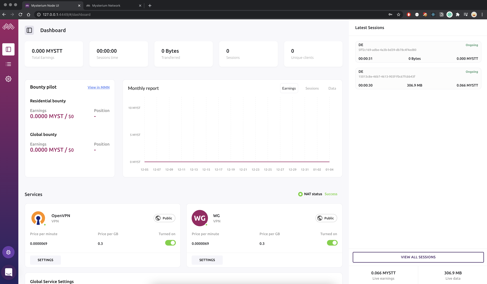
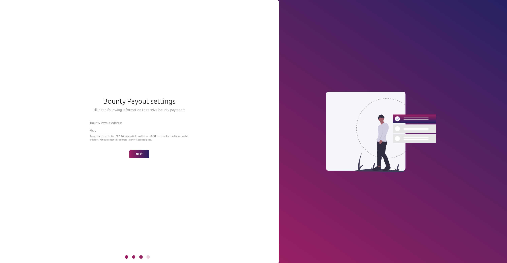
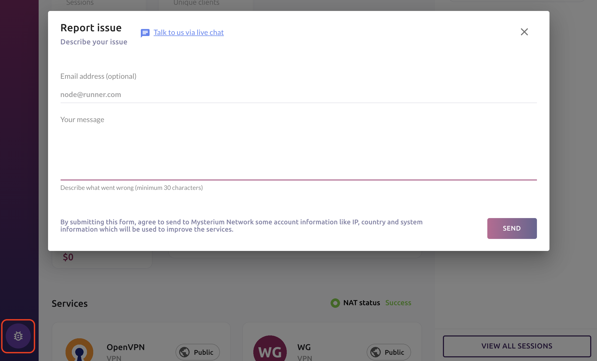

The built-in Node UI allows you to adjust your node's settings, manage services and payment details, view performance and real-time session metrics.

  

## How to login

Finding the UI when node is in a local network:
- If you're using a Macbook (OSX) or have Bonjour service installed on your OS, you can access it through http://raspberrypi.local:4449/ URL.
- On Windows, you should see a device in My Computer through the window explorer.
- Visiting your node's IP address under the port 4449 e.g. http://192.168.1.10:4449
- If the node is running locally on your computer you can access it through http://localhost:4449
- Go to my.mysterium.network, in your claimed node's dashboard, at the right top corner you'll find a "Node settings" button.

Finding the UI when node is in a data center:
- You will have to configure your server's firewall to expose the 4449 TCP port then access the UI through http://public-ip:4449

  

## Node and service configuration

Our onboarding wizard will walk you through the following steps to help you set up in no time.

To start running services and become eligible for the bounty program to receive MYST, you must set up a wallet for your node as well as claim your node in My Mysterium Network.

### Understanding Different NAT Types and Hole-Punching
A brief explanation of Network Address Translation (NAT) types, how they work with hole-punching and can affect the ability to create tunnels.

#### Normal (Full Cone) NAT
A full cone NAT is one where all requests from the same internal IP address and port are mapped to the same external IP address and port. Furthermore, any external host can send a packet to the internal host, by sending a packet to the mapped external address.

#### Restricted Cone NAT
A restricted cone NAT is one where all requests from the same internal IP address and port are mapped to the same external IP address and port. Unlike a full cone NAT, an external host (with IP address X) can send a packet to the internal host only if the internal host had previously sent a packet to IP address X.

#### Port Restricted Cone NAT
A port restricted cone NAT is like a restricted cone NAT, but the restriction includes port numbers. Specifically, an external host can send a packet, with source IP address X and source port P, to the internal host only if the internal host had previously sent a packet to IP address X and port P.

#### Symmetric NAT
A symmetric NAT is one where all requests from the same internal IP address and port, to a specific destination IP address and port, are mapped to the same external IP address and port. If the same host sends a packet with the same source address and port, but to a different destination, a different mapping is used. Furthermore, only the external host that receives a packet can send a UDP packet back to the internal host.

#### Hole-Punching
Using a previously established association to permit an arbitrary external address/port to send data to an internal address/port is referred to as hole-punching. Hole-punching is possible with normal (full-cone), restricted and port-restricted NATs, which map the same internal address/port consistently to an external address/port.

*NOTE: Hole-punching is not possible with purely symmetric NATs, due to their inconsistent destination-specific port mapping behavior.

#### NAT Test
Click the link below to run the DH2i NAT Test to determine whether your site is behind a Symmetric NAT device.
DH2i NAT Test: https://clients.dh2i.com/NatTest/

### Bounty Payout settings

The bounty payout address (ERC-20 or Polygon) is the address of your wallet where you want to receive your earnings.

  

### Node UI security

Your security is our top priority, therefore with the new release of the Testnet 2.0 node, we made it mandatory to change your Node UI password.
For bounty payouts, claim your node in MMN by providing the Node UI with your MMN API key.

  

### Advanced settings

### Reporting an issue

Occasionally you may need to send us your node logs for further investigation.
Simply click on the "Bug" button at the bottom left sidebar, provide us with an email address and explain the issue. Once we receive your logs, we'll get in touch to help you resolve it.

  

