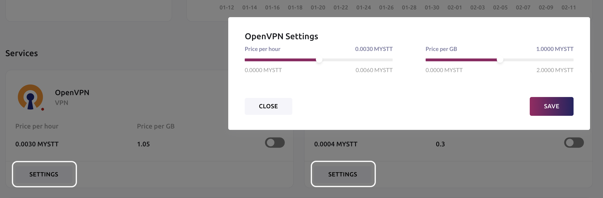
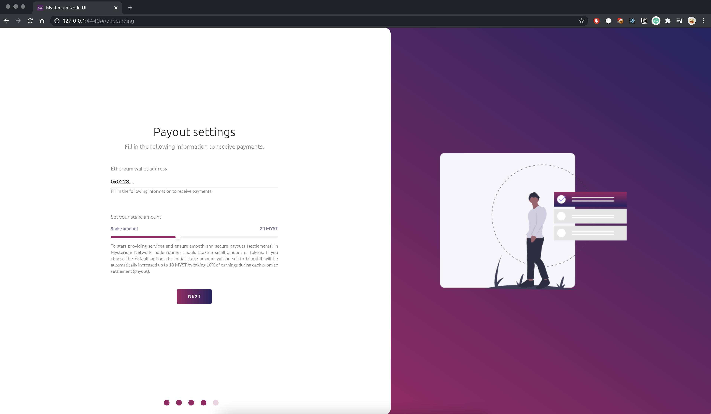
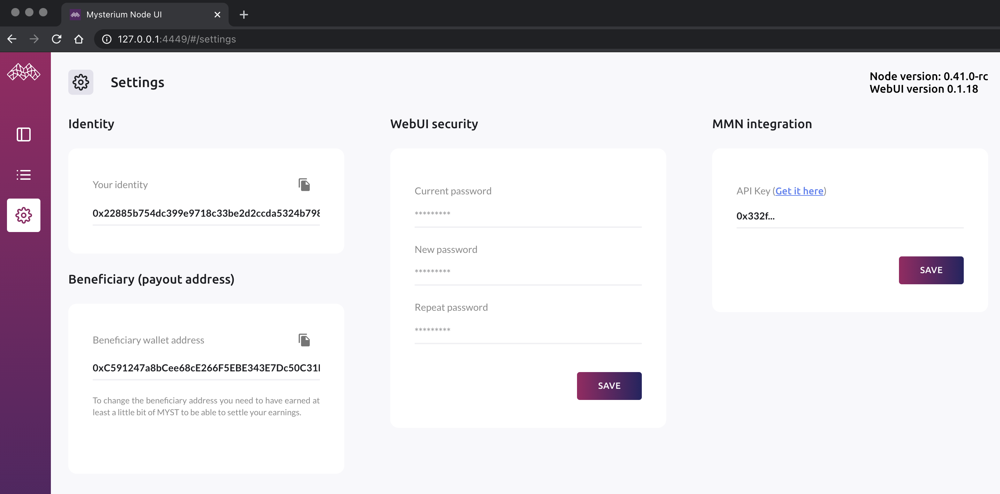

The built-in Node UI allows you to adjust your node's settings, manage services and payment details, view performance and real-time session metrics.

  

## How to login

Finding the UI when node is in a local network:
- If you're using a Macbook (OSX) or have Bonjour service installed on your OS, you can access it through http://raspberrypi.local:4449/ URL.
- On Windows, you should see a device in My Computer through the window explorer.
- Visiting your node's IP address under the port 4449 e.g. http://192.168.1.10:4449
- If the node is running locally on your computer you can access it through http://localhost:4449
- Go to my.mysterium.network, in your claimed node's dashboard, at the right top corner you'll find a "Node settings" button.

Finding the UI when node is in a data center:
- You will have to configure your server's firewall to expose the 4449 TCP port then access the UI through http://public-ip:4449

  

## Node and service configuration

Our onboarding wizard will walk you through the following steps to help you set up in no time.

To start running services and become eligible for the bounty program to receive MYST, you must set up a wallet for your node as well as claim your node in My Mysterium Network.

### Service price settings

We recommend keeping the defaults since they were fine-tuned for Testnet 2.0 and dVPN consumer apps. 

  

Change pricing for each service through the service settings.

  

### Payout settings

The beneficiary address is the address of your wallet where you want to receive your earnings.

  

### Node UI security

Your security is our top priority, therefore with the new release of the Testnet 2.0 node, we made it mandatory to change your Node UI password.
For bounty payouts, claim your node in MMN by providing the Node UI with your MMN API key.

  

### Adjusting settings

  

### Reporting an issue

Occasionally you may need to send us your node logs for further investigation.
Simply click on the "Bug" button at the bottom left sidebar, provide us with an email address and explain the issue. Once we receive your logs, we'll get in touch to help you resolve it.

  

