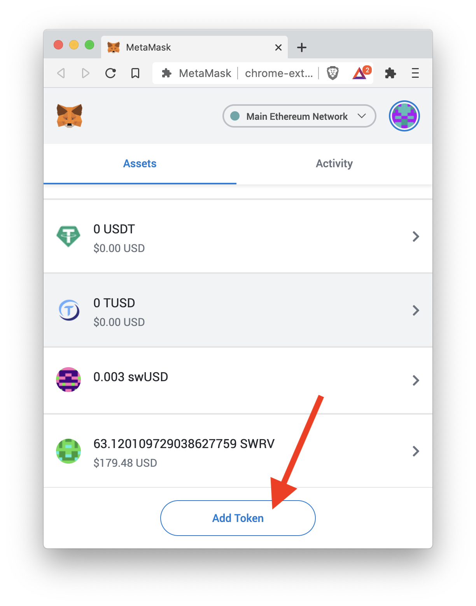

You can change the beneficiary (wallet) address once you earn at least a little bit of MYST.

Because the beneficiary is stored on the blockchain, in order to change it a transaction has to be made for which fees are paid.
Check a rought estimate of the fee in MYST [here](https://testnet2-transactor.mysterium.network/api/v1/fee/5/settle). Keep in mind that to get a human readable number you have to devide the "fee" by 1000000000000000000 or use a [converter](https://eth-converter.com/).

You can change it through the Node UI during the onboarding process or through the settings page.

To change the beneficiary address of Linux or RaspberryPi nodes via CLI, run:
```bash
myst cli
```

```bash
identities beneficiary <identity> <beneficiary>
```

If you run a node on a Docker container, run:
```bash
docker exec -ti myst myst cli
```

```bash
identities beneficiary <identity> <beneficiary>
```

## Supported wallets

There are two "types" of wallets that you can use: 

 
a) Crypto exchange wallets. A user-specific deposit wallet address to facilitate transfers to the exchange (**we currently support HitBTC and Bittrex deposit addresses only**). Always use the exchange's dedicated deposit workflow! If you think you sent assets to the wrong exchange account, please reach out to the exchange's customer support team.

b) Direct Blockchain wallets (such as Metamask, Trust wallet, Atomic, MEW, MyCrypto, Trezor, Ledger ...). 


MYST is a standard ERC-20 token, if wallet supports ERC-20 tokens (has possibility to add any custom ERC-20 token), then MYST can be added there.

**Important Notice**

Always do your own due diligence and research when dealing with exchanges or wallets. 
Most wallets do not support MYST token. We encourage providers to create a wallet mainly with the suggestions listed above. 

If you wish to add a wallet that was not listed above, we suggest that you first confirm with their respective support team if their wallet is capable of supporting MYST token. 
If you input a beneficiary address that is not supported, your funds will be lost forever.

We take no responsibility for the results and outcomes of using third-party software or platforms. 
We only recommend to hold/trade our tokens for the future purpose of using the Mysterium platform.


## Adding MYST token to MetaMask 


Ether (ETH) is already added to your MetaMask by default. You won’t need to go through this process to start depositing and withdrawing ETH. For other ERC-20 based tokens, you need to add them to your MetaMask asset tab.

To add tokens to your MetaMask, go to the main MetaMask account page. Click on the assets tab, where you’ll see Add Token at the bottom.

<div style="text-align:center">
  
</div>


After you click Add Token, navigate to the Custom Token tab and manually enter the MYST token details. Copy the Token Contract Address (please find below) and paste that onto the Custom Token tab on MetaMask. 
After this, you will be able to view your earned MYST tokens on the Assets tab. You will also have the option of swapping your chosen token for ETH or other ERC-20 tokens on the blockchain or sending them to Bittrex or HitBTC exchanges!

**MYST token details:**

**Contract : https://etherscan.io/address/0x4Cf89ca06ad997bC732Dc876ed2A7F26a9E7f361**

**Symbol: MYST**

**Decimals: 18**


On mobile, the process is exactly the same. However, you might find it a bit harder to copy and paste the Contract Token Address on the mobile app.

And that’s it. You’ve learned how to add your tokens and are a step closer to plunging into the decentralized ecosystem!

