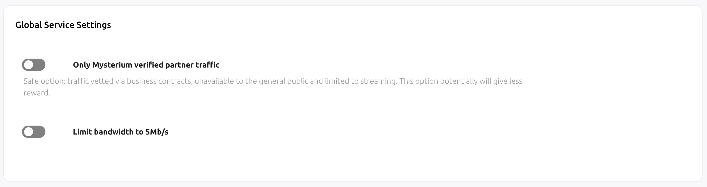

The default pricing range changes with certain node releases.

Our node network is constantly growing and while we prepare for our MainNet release
we want to make sure that the network consumers are able to connect to your node using properly adjusted price filtering.

#### Current VPN service pricing

The current pricing for the network consumers is:

- Maximum price per Gb: **0.5 MYST**
- Maximum price per hour: **0.0018 MYST** / **0.00003 MYST** per minute
- Hermes (accountant) fee: **15%**

Mysterium node runners are able to fine-tune and set their own pricing.

## Global service settings

Your Node UI allows you to change service settings for all of your VPN services.

  

>Enabling verified partner traffic option will prevent access to your nodes by everyone except our verified partners. 
>This option is more secure, however will likely bring you lower bounty earnings.

## My node is not displayed in Mobile or Desktop apps

If your node is not available in our consumer apps, you should make sure that the configuration is correct:

- Your price range may be out of bounds with the currently implemented pricing ranges in the apps.
- Your node is using the verified partner traffic option
- Your node is outdated. Read our [update guide](/node-runners/setup/updating/).
