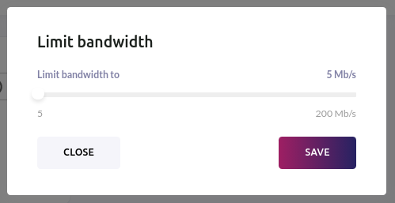

## Automatic pricing

Starting from Mainnet pricing model for Node runners is automatic. By providing automatic pricing we aim to make them competitive across all node runners and improve Node visibility.  

## Global service settings

Your Node UI allows you to change service settings for all of your VPN services.

  

  

>Enabling verified partner traffic option will prevent access to your nodes by everyone except our verified partners. 
>This option is more secure, however will likely bring you lower bounty earnings.

## My node is not displayed in Mobile or Desktop apps

If your node is not available in our consumer apps, you should make sure that the configuration is correct:

- Your node is using the verified partner traffic/whitelisting option
- Your node quality is too low (switch quality slider from Medium+ to Any to view it)
- Your node is outdated. Read our [update guide](/node-runners/setup/updating/).
