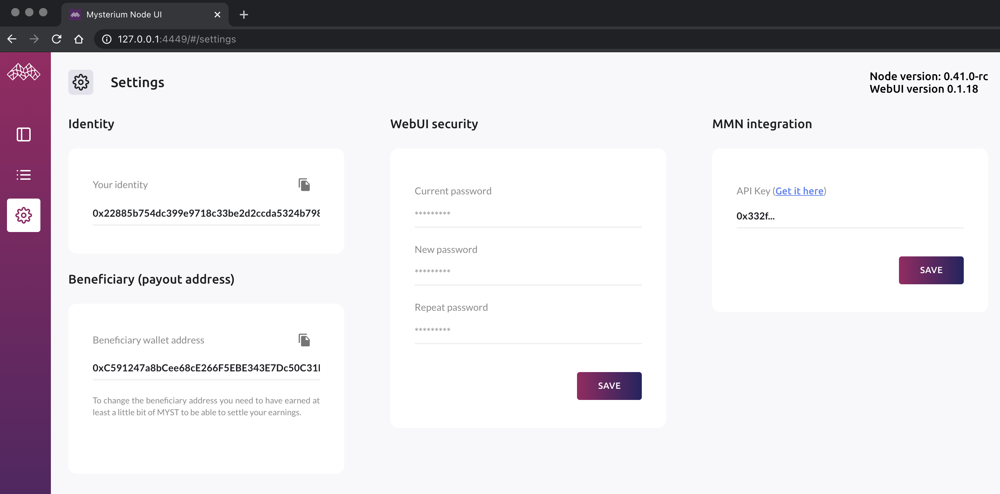

  
### Why we’re migrating into Testnet 2.0

We’ve deployed the newest version of our smart contracts onto the Goerli testnet blockchain. With this network upgrade, node registration flow has changed. Providers will get free registration with zero stake (while still on Testnet 2.0) and will retain the same Testnet 1.0 identity. These new smart contracts are also using a new version of MYSTT token. It’s essentially the same as our real MYST token, but on Goerli testnet. It has 18 zeros after comma (instead of 8 ), which required us to refactor all payments-related code to account for micropayments as we transition to Ethereum Mainnet.

### Top up with your crypto of choice

Top up Mysterium VPN balance using various cryptocurrencies (other than MYST), such as BTC, LTC, ETH, Dai and more! This functionality is supported by an upgraded Hermes protocol, with our micropayments hub now supporting multiple chains.

Interested in finding out more? Deep dive into [how we evaluated and chose the right L2 scaling partner for Mysterium Network](https://mysterium.network/blog/layer-2-the-search-for-the-cheapest-and-fastest-microtransactions/).

### Mysterium is now unblocked in China!

We’ve been working hard to reverse [the ban of Mysterium VPN in China](https://medium.com/mysterium-network/china-where-is-your-internet-e03824fea13c). The first iteration of our unblocking is done. Start using Testnet 2.0 apps (node v0.40+) to access Mysterium Network from China!

### Cleaner UI

We’ve updated the Web UI so it is far more stable, with fewer glitches.

We found and fixed lots of bugs found during ALPHA testing in preparation of our upcoming node release.

We also created user-friendly consumer CLI commands.
Now it’s much easier to use [Mysterium VPN for advanced Linux users](/user-guide/) and on servers.

### Matic x Mysterium

We started working on our [integration with Matic Network](https://mysterium.network/blog/matic-network-powers-mysterium-p2p-payments/). Most of our infrastructure components are ready for Matic, so now we’re working on building the Matic<>Ethereum bridges needed before it’s public release.

### My.Mysterium.Network (MMN) updates

The Testnet 2.0 version of MMN will look a little different than the current version, and we hope it will solve a couple of usability problems we had before.

Nodes can also store beneficiary (payout) wallet addresses on the Ethereum blockchain, instead of a database. The new MMN has been adapted so it can be used for bounty payments.

We also discovered some node runners who were cheating the system. We therefore started a blacklist so they could not participate in any future bounty program.

### Earn in 2 networks during the migration

We’ve updated and deployed multiple versions of MMN, so users of Testnet 1.0 & Testnet 2.0 networks could get access to an aggregated node dashboards. 
VPN services rendered on Testnet 2.0 will run alongside VPN services on Testnet 1.0 in January 2021. **Earn double while we migrate nodes across to Testnet 2.0!**

## Ready to upgrade? Here's how.

Firstly you will need to [update your nodes](/node-runners/setup/updating/) and [log into the Web UI](/node-runners/webui/).

**How to update your current MMN/Web UI settings to be compatible with Testnet 2.0?**

  

After a successful installation, you will be welcomed by our onboarding wizard. It will guide you through all the necessary steps to set things up.
Once you go through it, if you find yourself needing to change anything, you can simply visit the settings page to make changes.
  

  

**How to claim your Testnet 2.0 node in MMN**

There are two ways of claiming your node:

1. By logging into the built-in Web UI and going through the onboarding process.
2. By running the below commands via Mysterium CLI (CLI is a command line interface that allows you to manipulate a Mysterium node using just your terminal. It can be started using a myst cli command):

*Agree to ToS (term of use)*: `myst cli --agreed-terms-and-conditions`

*Claim your node*: `mmn {api_key}`

**Note:** You can find and copy your MMN API key in your [MMN profile](https://testnet2.mysterium.network/user/profile). Your API key allows you to claim your nodes via the node’s WebUI and CLI.
