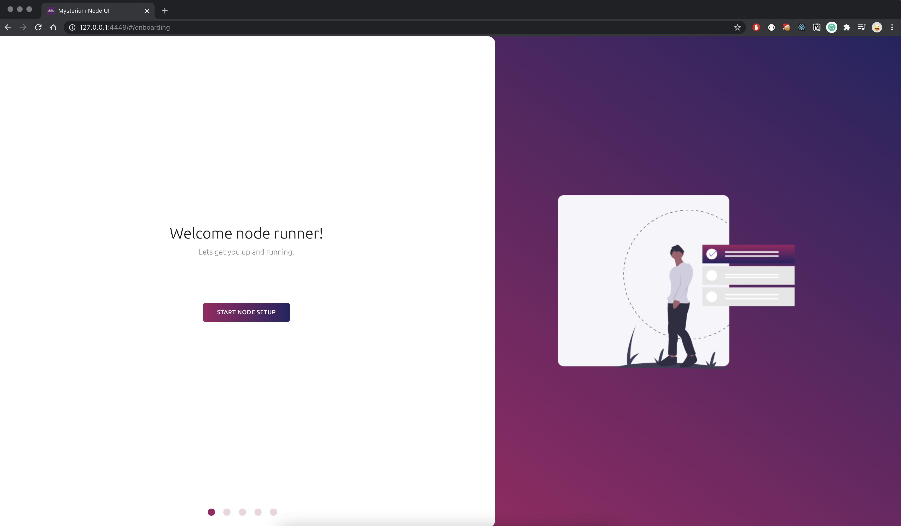

**If you are running a Raspberry Pi node it's likely that your node has migrated automatically.**

If your node becomes **"Offline"** in My Mysterium Network (MMN), that means it switched networks and is now running in Testnet 2.0.
The new Testnet 2.0 uses a new version of My Mysterium Network to which your accounts were transferred, but your nodes were not.

The new Testnet 2.0 My Mysterium Network platform is hosted on https://testnet2.mysterium.network.

Your accounts from https://my.mysterium.network were migrated into https://testnet2.mysterium.network on January the 8th, so you should be able to login using the same credentials on both systems.

## Updating your node

If your node does not auto-update or something goes wrong. You can follow the following steps to update:

### How to update your Raspberry Pi node

SSH into your Raspberry Pi using the following command:

```bash
ssh myst@ip-of-your-raspberry
```

The default password is  `mystberry`.

Then to update your RPI, run:

```bash
sudo apt update; sudo apt install myst
```

### How to update your Linux node

To update your Linux node, run:
```bash
sudo apt update; sudo apt install myst
```

### How to update your Docker node

In order to update your Docker node, run the following commands.

Use the latest docker image:

```bash
docker pull mysteriumnetwork/myst:latest
```

Restart your container and you should be up to date.

## Confirm your node is running

To confirm that your node is running on Linux and RPi, check the service status:
```bash
sudo systemctl status mysterium-node.service 
```

The output should look something like this:
```bash
mysterium@pop-os:~$ sudo systemctl status mysterium-node.service 
● mysterium-node.service - Server for Mysterium - decentralised VPN Network
     Loaded: loaded (/lib/systemd/system/mysterium-node.service; enabled; vendor preset: enabled)
     Active: active (running) since Fri 2021-01-04 00:00:00 GMT;
       Docs: https://mysterium.network/
   Main PID: 1920 (myst)
      Tasks: 30 (limit: 19009)
     Memory: 73.0M
```

On Docker, list your active containers:
```bash
docker ps
```
Your container should be up and running:
```bash
CONTAINER ID   IMAGE                          COMMAND                  CREATED          STATUS
074a8fcb572c   mysteriumnetwork/myst:latest   "/usr/local/bin/dock…"   44 seconds ago   Up 42 seconds  
```

## Claim your nodes

The new 0.41.0 node has many new features including a new Node UI.

Once your node is updated, you must visit the Node UI to finish setting up your node.
For a majority of nodes your payout (beneficiary) addresses were migrated to the new network.
If you changed your address after the 4th of January, it's possible that the new network is using your old payout address.

For your nodes to appear in the new My Mysterium platform you must claim them via the new Node UI or CLI app.

### How to login to the Node UI

When your node is in a local network:
- If you're using a Macbook (OSX) or have Bonjour service installed on your OS, you can access it through http://raspberrypi.local:4449/ URL.
- On Windows, you should see a device in My Computer through the window explorer.
- Visiting your node's IP address under the port 4449 e.g. http://192.168.1.10:4449
- If the node is running locally on your computer you can access it through http://localhost:4449

When your node is in a data center:
- You will have to configure your server's firewall to expose the 4449 TCP port then access the UI through http://public-ip:4449

<div style="text-align:center">
  
</div>


### How to claim your Testnet 2.0 node

There are two ways of claiming your node:

1. By logging into the built-in Node UI and going through the onboarding process.
2. By running the below commands via Mysterium CLI (CLI is a command line interface that allows you to manipulate a Mysterium node using just your terminal. It can be started using a myst cli command):

*Agree to Terms of Use (once)*: 
```bash
myst cli --agreed-terms-and-conditions`
```

*Claim your node*: 
```bash
mmn {api_key}
```

**Note:** You can find and copy your MMN API key in your [MMN profile](https://testnet2.mysterium.network/user/profile).

### Change payout (beneficiary) address

You can change the beneficiary address once you earn at least a little bit of MYST. The amount varies, but it's somewhere between 1 and 2 MYST. 
This is because a blockchain transaction will be made and you need to cover its fees.

You can change it through the Node UI during the onboarding process or through the settings page.

To change it via the CLI, run:

```bash
myst cli
```

```bash
identities beneficiary <identity> <beneficiary>
```
