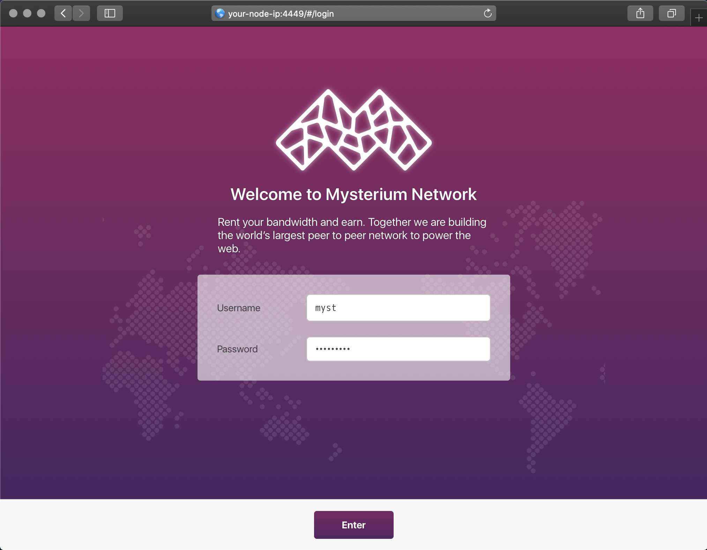
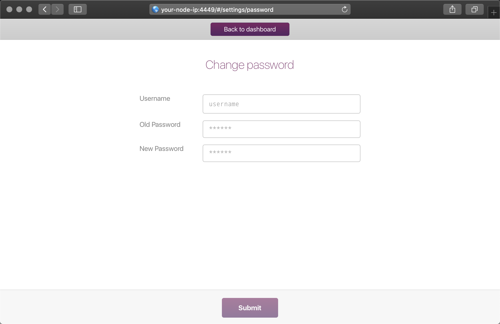

The built-in Node UI allows you to adjust your node's settings, manage services and payment details, view performance and real-time session metrics.

## How to login

Finding the UI when node is in a local network:
- If you're using a Macbook (OSX) or have Bonjour service installed on your OS, you can access it through http://raspberrypi.local:4449/ URL.
- On Windows, you should see a device in My Computer through the window explorer.
- Visiting your node's IP address under the port 4449 e.g. http://192.168.1.10:4449
- If the node is running locally on your computer you can access it through http://localhost:4449
- Go to my.mysterium.network, in your claimed node's dashboard, at the right top corner you'll find a "Node settings" button.

Finding the UI when node is in a data center:
- You will have to configure your server's firewall to expose the 4449 TCP port then access the UI through http://public-ip:4449

  

## Default credentials

|           | credential
|-----------|-----------|
| Username  | myst
| Password  | mystberry

## Setting up your wallet
To be eligible for the bounty program and receive ETH, you must set up a wallet for your node.

Login to your node UI and go into the "Settings" page.

  

## Securing your node (recommended)

For security purposes, we highly recommend that you change your Node UI's password.

  

